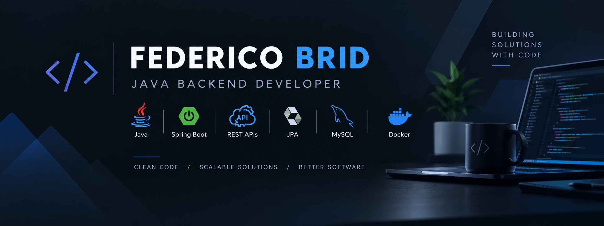

# Hi, I'm Federico Brid 👋

### ☕ Java Backend Developer | Spring Boot | REST APIs

Building backend applications with **Java & Spring Boot**, focusing on well-structured applications, REST APIs, databases and Docker.

 

---

## 👨‍💻 About Me

I'm a **Full Stack Developer focused on Java backend development**.

My main focus is building applications with **Spring Boot**, creating REST APIs, working with relational databases and applying good software development practices.

I'm currently strengthening my backend skills and expanding my knowledge of software architecture, Docker and backend development practices.

---

## 🛠️ Tech Stack

### Backend

- Java
- Spring Boot
- Spring Data JPA / Hibernate
- REST APIs
- Maven

### Database & Tools

- MySQL
- PostgreSQL
- Docker
- Git / GitHub
- Postman

### Frontend

- JavaScript
- React
- Vite
- HTML / CSS

---

## 🚀 Featured Projects

### Employee Management

Full Stack application for managing employees, developed with a **Spring Boot REST API** and React frontend.

The application includes employee CRUD operations, data validation, database persistence and a Dockerized development environment.

**Backend:** Java · Spring Boot · Spring Data JPA · MySQL · Docker

**Frontend:** React · Vite · Material UI

- [Backend Repository](https://github.com/FedericoBrid/EmployeeManagment)
- [Frontend Repository](https://github.com/FedericoBrid/EmployeeManagmentFrontend)

---

### Challenge Supermarket

Backend application developed with **Java and Spring Boot** for managing products, branches and sales.

The project implements a REST API with CRUD operations, relational database persistence and business logic for managing sales and their details.

It was developed following a layered architecture, separating controllers, services, repositories and data models.

**Java · Spring Boot · Spring Data JPA · REST API · MySQL**

- [Repository](https://github.com/FedericoBrid/ChallengeSupermarket)

---

### Donar App

Web application developed for managing **blood donation requests and connecting donors with blood donation centers**.

The application allows users to register, manage donation requests and search for compatible blood donation opportunities based on blood type.

The project was developed using the **MVC architectural pattern**, with PHP handling the backend logic and MySQL for data persistence.

**PHP · MVC · PDO · MySQL · Bootstrap**

🔒 **Private Repository**

---

## 📫 Contact

📧 **[federicobrid@gmail.com](mailto:federicobrid@gmail.com)**

 

[GitHub](https://github.com/FedericoBrid)

 

[LinkedIn](https://www.linkedin.com/in/federicobrid)

---

### ☕ Java • Spring Boot • Backend Development

